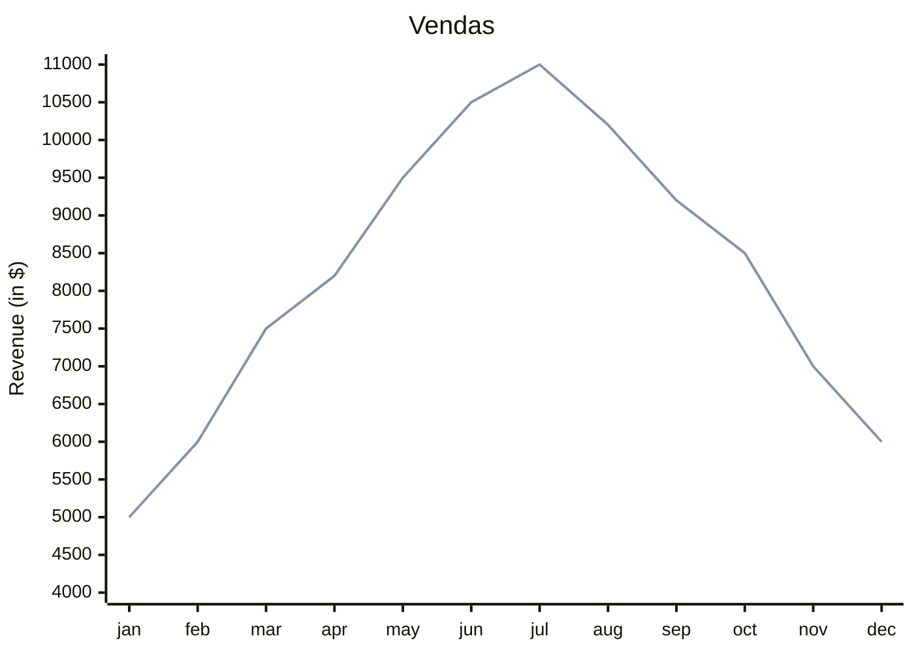

#engehnsria de software 2/2026 
repositorio para materia de engenharia de software 
Curso engneharia da computação
Curso descreve toda a engenharia por traz da computação  
Curso é oferecido pelo IFMT
Meu erro foi ...........

